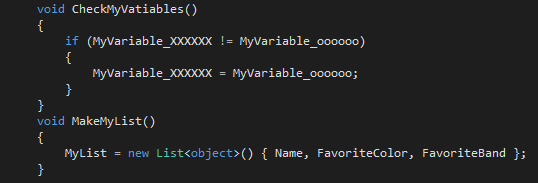
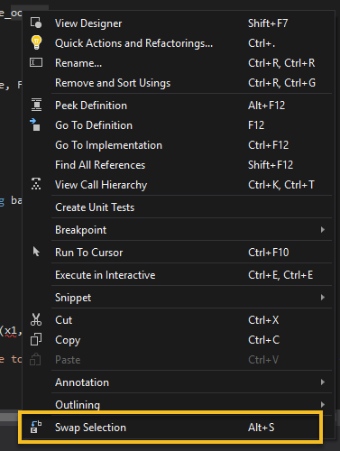
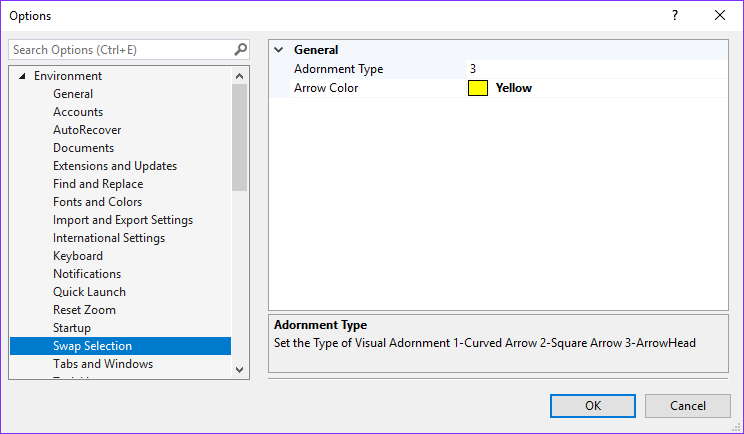
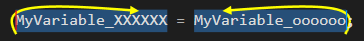
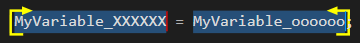
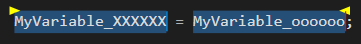

# Swap Selection

<!-- Replace this badge with your own-->

<!-- Update the VS Gallery link after you upload the VSIX-->
Download this extension from the [VS Gallery](https://marketplace.visualstudio.com/items?itemName=SSDiver2112.SwapSelection)
or get the [CI build](http://vsixgallery.com/extension/cc65354e-e926-4e76-ac83-370537081730/).

---------------------------------------

Quickly swap two groups of selected text by taking advantage of the Multi-Selection capability in Visual Studio 2022.

See the [change log](CHANGELOG.md) for changes and road map.

## Features

- Use Multi-Selection to select two pieces of text and then swap them. 

### Swap Selected Text

Select some text, Select some secondary text (Ctrl+Alt + double-click to add a secondary word or Ctrl+Alt + click + drag to select a secondary selection of text.)
Right-Click and select 'Swap Selection' or Shortcut Key Alt-S.

### Options

Use the Tools/Options page to change the Color and type of the Swap adornment.

Type 1 

Type 2 

Type 3 

## Contribute
Check out the [contribution guidelines](CONTRIBUTING.md)
if you want to contribute to this project.

For cloning and building this project yourself, make sure
to install the
[Extensibility Tools 2015](https://visualstudiogallery.msdn.microsoft.com/ab39a092-1343-46e2-b0f1-6a3f91155aa6)
extension for Visual Studio which enables some features
used by this project.

## License
[Apache 2.0](LICENSE)